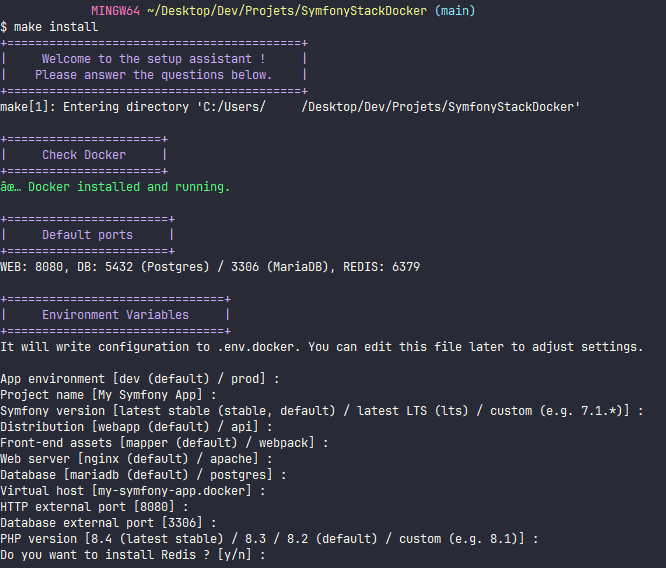

# 🚀 Symfony Stack Docker

**SymfonyStackDocker** is a complete development foundation for Symfony projects, driven by an interactive assistant via a `Makefile`. It allows you to launch a containerized Symfony project in seconds, with pre-configured production and pre-production environments.

---

## 🌟 Highlights

- **🛠 Interactive Assistant**: A `make install` wizard guides you through project configuration (Vhost, DB, Symfony version, etc.).
- **🐳 Multi-Stack Docker**:
    - Choice of Web Server: **Nginx** or **Apache**.
    - Choice of Database: **MariaDB** or **PostgreSQL**.
    - Optional **Redis** support.
- **📦 Asset Management**: Native support for **Asset Mapper** (modern) or **Webpack Encore** (classic).
- **✅ Code Quality**: Pre-configured tooling (PHPStan, PHP-CS-Fixer, PHPUnit, TwigCS).
- **🔎 Comprehensive Debugging**: Mailpit for emails, phpMyAdmin (if MariaDB), Xdebug ready to use.
- **🚀 Deployment Ready**: Deployment scripts and standardized production directory structure.

---

## 📋 Requirements

- **Docker** & **Docker Compose** V2
- **GNU Make**
- **Git Bash** (recommended for Windows) or WSL

> ⚠️ **Windows Users**: Run all commands in a Git Bash or WSL terminal.

---

## ⚙️ Quick Installation

1. **Clone the repository**:
   ```bash
   git clone https://github.com/Engrev/SymfonyStackDocker.git my-project
   cd my-project
   ```

2. **Launch the installation assistant**:
   ```bash
   make install
   ```
   The assistant will:
   - Verify your Docker installation.
   - Ask questions about your configuration (project name, Symfony version, DB type, etc.).
   - Build Docker images and start containers.
   - Install a new Symfony application in the `/app` folder.
   - Install all development dependencies.
   - Attempt to add your domain (e.g., `symfony.local`) to your `hosts` file.



---

## 🧰 Essential Commands (Makefile)

### 🐳 Docker & Infrastructure
| Command | Description |
| :--- | :--- |
| `make up` | Start containers in the background. |
| `make down` | Stop and remove containers. |
| `make restart` | Full restart (down + up). |
| `make ps` | Show container status. |
| `make logs` | Show logs for all services. |
| `make terminal-php` | Enter the PHP container (as `www-data` user). |

### 🎼 Symfony & Composer
| Command | Description |
| :--- | :--- |
| `make console ARGS="..."` | Run a Symfony console command. |
| `make composer ARGS="..."` | Run a Composer command. |
| `make cc` | Clear the application cache. |

### 🗄️ Database
| Command | Description |
| :--- | :--- |
| `make db-migrate` | Run Doctrine migrations. |
| `make db-fixtures` | Load fixtures. |
| `make db-reset` | Reset the database (Drop, Create, Migrate). |
| `make db-dump` | Create a SQL export in `var/dump.sql`. |
| `make db-import` | Import `var/dump.sql` (or specified via `ARGS`). |

### 🧪 Quality & Tests
| Command | Description |
| :--- | :--- |
| `make tests` | Run the full test suite (Linters, PHPStan, PHPUnit). |
| `make phpstan` | Run static analysis. |
| `make php-cs-fixer` | Automatically fix coding standards. |
| `make phpunit` | Run unit and functional tests. |

---

## 🏗 Project Structure

```text
.
├── .docker/                # Docker configuration (PHP, Web, Node, etc.)
├── app/                    # 📂 Symfony source code (generated at install)
│   ├── src/                # Your controllers, entities, services...
│   ├── templates/          # Twig views
│   ├── public/             # Web entry point
│   └── tests/              # Automated tests
├── makefiles/              # Modular Makefile scripts
├── docker-compose.yml      # Docker orchestration
├── Makefile                # Automation entry point
└── .env.docker             # Docker environment variables
```

---

## 🔍 Debugging & Tools

- **Mailpit**: Interception of emails sent by the app.
  - Access: `http://<vhost>:8025`
- **phpMyAdmin**: DB management (if MariaDB).
  - Access: `http://<vhost>:<configured_port>` (default 8081).
- **Xdebug**: Already installed, disabled by default.
  - `make xdebug-on` / `make xdebug-off`
- **Redis**: Optional support.
  - `make redis-on` / `make redis-off`

---

## 🚀 Deployment

The project is designed for secure and professional deployment:
1. **Server Structure**: Uses a `releases/` and symbolic link (`current/`) system for zero-downtime deployments.
2. **Included Scripts**: `activate_release.sh` and `rollback.sh` to automate production rollouts.
3. **GitHub Actions**: Ready-to-use workflow for SSH deployment with deploy keys.

Check the [**DEPLOYING.md**](doc/DEPLOYING.md) file for the detailed step-by-step production setup guide.

---

## 🧹 Cleanup & Reset

- `make reset`: Deletes the `/app` folder, generated configurations, and containers. Allows you to start fresh with `make install`.

---

## 📄 License

This project is licensed under the MIT License. You are free to use and modify it.

---
*Built with ❤️ to simplify Symfony development.*
